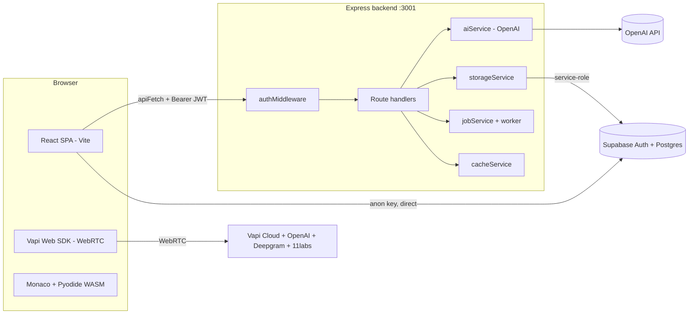

# 01 — Current Project Analysis

A grounded analysis of the existing ACE.AI implementation: how it is built, what it does well, and where it carries debt that the rebuild should *not* reproduce.

---

## 1. High-level architecture

ACE.AI is a **two-process monorepo**:

```
ai-interviewer/
├── frontend/   React 19 + Vite 8 SPA       (dev port 5173)
└── backend/    Express 5 + TypeScript API   (dev port 3001)
```

They are fully decoupled. The frontend is a static SPA that talks to the backend over HTTP via a single `apiFetch()` wrapper, attaching a Supabase access token as a Bearer header. There is **no proxy** — the frontend calls the backend directly through `VITE_API_URL`.



### Two independent paths to Supabase
- **Frontend → Supabase directly** using the **anon key** for all auth (login, signup, OAuth, session, `profiles` upsert on signup).
- **Backend → Supabase** using the **service-role key** (bypasses RLS) for all interview reads/writes and token verification.

This split is deliberate and mostly sound. It does mean two clients, two key types, and auth knowledge spread across both processes.

---

## 2. Frontend architecture

- **Entry:** `main.tsx` → `RouterProvider` with `createBrowserRouter` (`routes.tsx`). All 11 routes are client-rendered; 9 of them are wrapped in `<ProtectedRoute>`.
- **Routing:** React Router v7 used purely as a client router — *no loaders, no actions*. Navigation is `useNavigate` and configuration is passed through `location.state`.
- **State management:** No global store (no Redux/Zustand/Context for app state). State is local `useState` in page components plus three custom hooks:
  - `useVapiInterview` / `useVapiTechnicalInterview` — own the entire voice-call lifecycle (status, transcript, mute, volume, analyze).
  - `useCodeExecution` — multi-runtime code runner (JS/TS sandbox, Pyodide, remote).
  - `useKeyboardShortcuts` — keybindings for the technical interview.
- **Auth surface:** `services/auth.ts` is the *only* auth module. It warms a synchronous `_cachedUser` from the Supabase session and keeps it in sync via `onAuthStateChange`. `apiFetch()` reads the live session token per request and hard-redirects to `/login` on 401.
- **Data fetching:** Done in components via `useEffect(() => api().then(setState), [])`. Examples: `AnalyticsDashboard` (`getInterviewHistory`), `InterviewsPage`, `InterviewReplayPage`, `TechnicalInterviewLayout` (`generateInterviewQuestions`).
- **Voice/editor:** `lib/vapi.ts` is a singleton Vapi client (flagged "never modify"). The technical interview composes Monaco + a problem bank + chat + toolbar in `TechnicalInterviewLayout`.

### Configuration flow (important and fragile)
`SetupDashboard` collects role/difficulty/strictness/experience/interviewer/topics/language and navigates with **router state**:
```ts
navigate("/interview/voice", { state: { role, difficulty, ... } });
```
The interview pages read `location.state`. **This state is lost on refresh** and is invisible to any server. The analytics page similarly receives `{ result, config, interviewId }` via state and falls back to fetched history if state is absent.

---

## 3. Backend architecture

- **Express 5** with `helmet`, configurable CORS allow-list, 1 MB JSON body limit, four `express-rate-limit` tiers (global/auth/ai/execute), and a centralized error handler that never leaks internals.
- **Auth middleware** verifies `Authorization: Bearer <token>` by calling `supabase.auth.getUser(token)` and attaches `req.user = { id, email }`.
- **Routes:**
  - `auth.ts` — `GET/PATCH /me` (profile + role). Login/signup are explicitly *not* here.
  - `analysis.ts` — `POST /questions`, `POST /evaluate`, async variants (`/questions/async`, `/evaluate/async`), `GET /history`.
  - `interviews.ts` — `GET /` (list, no transcript), `GET /:id` (full).
  - `execute.ts` — `POST /` runs Java/C++/Bash.
  - `jobs.ts` — `GET /:id` poll, owner-scoped.
  - `analytics.ts` — `GET /dashboard`, cached 60s.
  - `vapi.ts` — webhooks (public).
- **Services:** `aiService` (OpenAI prompts + parsing + fallbacks + cache), `storageService` (interview CRUD, `created_at → date` mapping), `analyticsService` (metric aggregation), `jobService`/`jobServiceBullmq`/`worker` (in-memory or Redis), `cacheService`, `systemMetrics`, `codeExecutionService`.
- **Optional infra:** Jobs, cache, and metrics all run in-memory by default and transparently upgrade to **Redis/BullMQ** when `REDIS_URL` is set. No required infra for local dev.

---

## 4. Strengths

| Strength | Detail |
|---|---|
| Clean service separation (backend) | `aiService`, `storageService`, `analyticsService`, `jobService` are well-isolated and individually testable. |
| Strong prompt engineering | `buildSystemPrompt` encodes difficulty/experience/strictness/type plus an extensive speech-style guide for natural voice. High-value, reusable business logic. |
| Security posture | Helmet, CORS allow-list, tiered rate limiting, body-size cap, sanitized errors, owner-scoped queries, 404-on-not-owner to avoid enumeration. |
| Graceful degradation | Jobs/cache/metrics fall back to in-memory; AI calls have fallback problems and default evaluations; Vapi errors recover to `idle`. |
| Sensible auth model | Frontend owns the Supabase session; backend only verifies. No custom password handling. |
| Good test coverage signals | Vitest suites for services, routes, security hardening; Playwright E2E mentioned. |
| Code-execution sandboxing | Thoughtful: in-browser for JS/TS/Python, server for compiled langs, float-tolerant deep equality, JSON round-trips for Pyodide. |

---

## 5. Weaknesses & technical debt

| Issue | Where | Impact | Rebuild action |
|---|---|---|---|
| **Client-side `useEffect` data fetching for initial data** | `AnalyticsDashboard`, `InterviewsPage`, `InterviewReplayPage` | Waterfalls, spinners, no SSR, poor TTFB, data not cacheable at the edge | Move to Server Components reading Supabase directly ([07](./07-data-flow.md)) |
| **Config via `location.state`** | Setup → interview → analytics | Lost on refresh, invisible to server, no deep-linking/sharing | Persist setup server-side or encode in URL ([05](./05-routing-plan.md), [17](./17-open-questions.md)) |
| **Auth check after render** | `ProtectedRoute` shows a spinner, then redirects | Flash of loading, protected content logic runs client-side | Enforce in middleware + server layout ([08](./08-authentication.md)) |
| **Two deploy targets, two processes** | FE + BE | More ops surface, CORS config, duplicated types | Collapse into one Next.js app |
| **Duplicated types across FE/BE** | `VapiAnalysisResult`, `CodingProblem`, `TranscriptEntry` defined in both | Drift risk | Single shared `types/` in one app |
| **Dead/legacy code** | `db.ts` stub, `pg` dependency, `bcryptjs`, `jsonwebtoken`, text-interview `/start` `/next`, `authService.ts`, `VapiTest.tsx`, `DashboardDemo` | Confusion, bundle/install weight | Do not port; see [02](./02-feature-inventory.md) |
| **Redundant analytics fetch** | `AnalyticsDashboard` fetches full `/history` (with transcripts) just to chart scores | Over-fetching | Use the lighter `/dashboard` aggregate or a server query selecting only needed columns |
| **No SSR/SEO** | Entire app is a client SPA | Marketing/landing pages invisible to crawlers | Static + metadata for public pages ([14](./14-seo-metadata.md)) |
| **Large client bundles shipped eagerly** | Monaco, Recharts, Framer Motion, Vapi all client | Heavy JS for users who may not reach those pages | Code-split + server-render non-interactive parts ([15](./15-performance.md)) |
| **`stripTypeScript` regex transpiler** | `useCodeExecution` | Fragile by design (admitted in comments) | Acceptable to keep; consider real TS transpile later |
| **`console.log` noise** | Vapi hooks, layouts | Production log spam | Strip/condition during rebuild |

---

## 6. Areas that naturally fit Next.js (server-first wins)

- **Interview history list** (`/interviews`) — pure read, owner-scoped → Server Component.
- **Single interview replay** (`/interviews/:id`) — pure read → Server Component + dynamic segment.
- **Analytics dashboard aggregate** (`/dashboard`) — server query + cache + streaming.
- **Profile / role** (`/me`, `/me/role`) — server read + Server Action mutation.
- **Question generation & evaluation** (OpenAI) — server-only secrets; Server Action or Route Handler.
- **Code execution for compiled langs** — Route Handler (machine endpoint).
- **Auth gating** — middleware + protected layout.
- **Marketing/landing** — static render + metadata.

## 7. Areas that must stay client-side

- **Vapi voice call** — WebRTC, microphone, Web Audio `AudioContext.resume()` in a user gesture, real-time events. Hard client boundary.
- **Monaco editor** — browser-only.
- **Pyodide code execution** — WASM in the browser.
- **Live transcript, mute, volume meter, countdown timer, keyboard shortcuts** — real-time client interactivity.
- **Recharts charts** — render client-side (can be lazy/islanded under server-fetched data).

See [06-server-vs-client.md](./06-server-vs-client.md) for the per-feature decision matrix.
