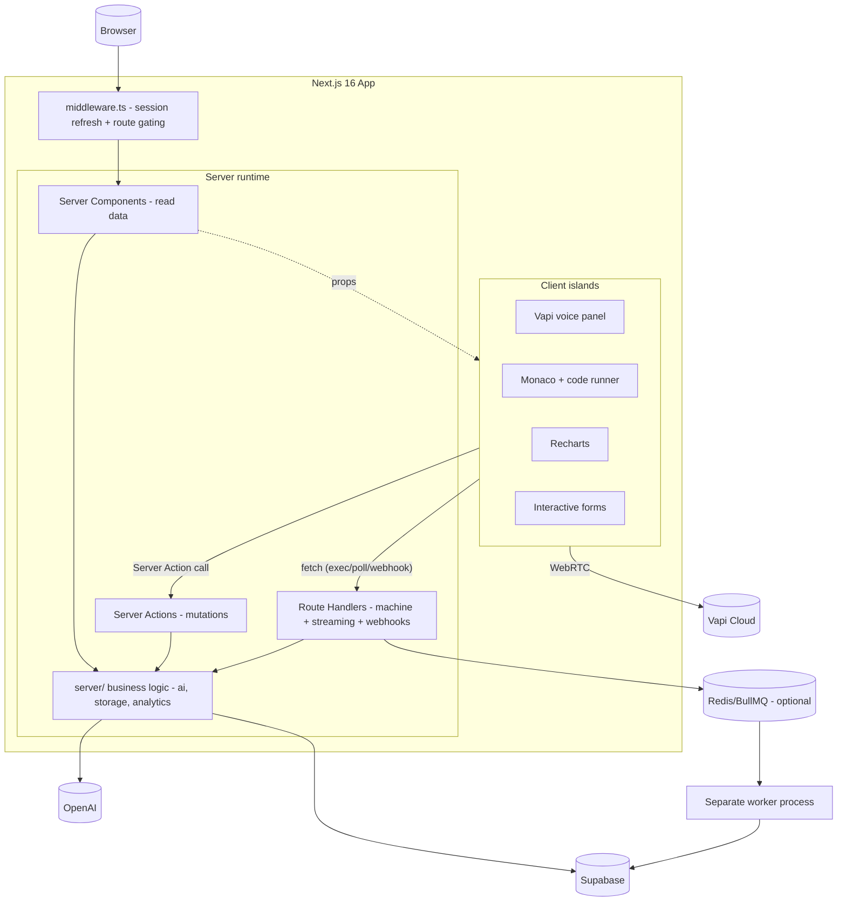
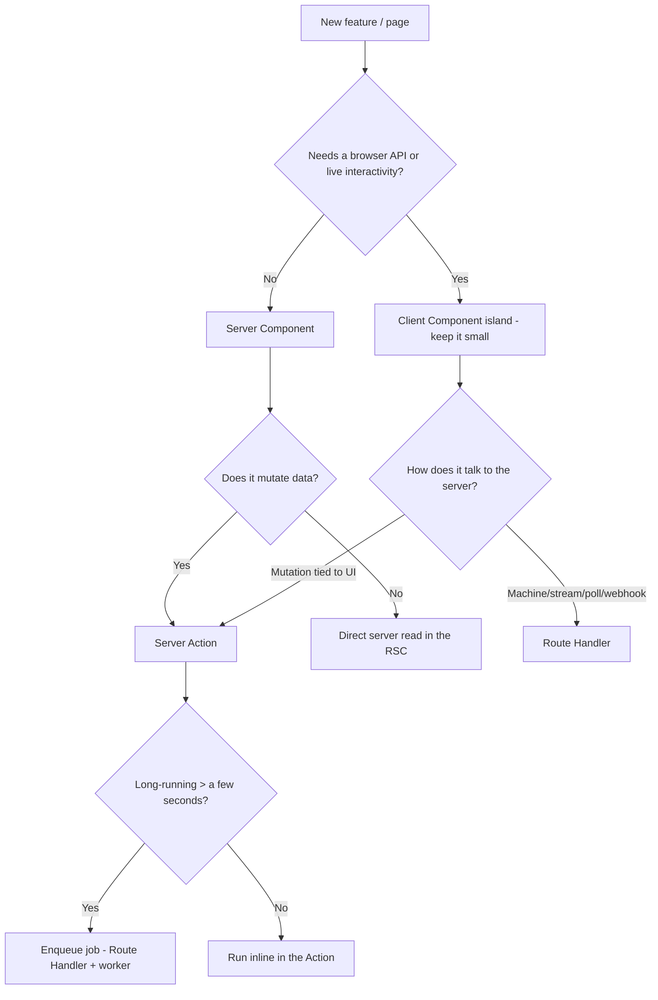

# 03 — Target Next.js 16 Architecture

The architecture the rebuild should embody. Read this before [04](./04-folder-structure.md)–[13](./13-database.md); those are concrete expressions of these principles.

---

## 1. One application, server-first

Collapse the two-process (Vite SPA + Express) design into a **single Next.js 16 App Router application**. The Express backend disappears as a separate deployable; its responsibilities are redistributed:

---

## 2. The decision hierarchy (apply to every feature)

Resolve in order; stop at the first that fits.

### Rules of thumb
- **Default to a Server Component.** A Client Component must justify itself with a browser API or interactivity.
- **Mutations are Server Actions** unless they're machine-to-machine (then Route Handler).
- **Reads happen on the server**, as close to render as possible — pass data down as props.
- **Push the `"use client"` boundary as deep as possible** ("client islands"), so most of the tree stays server-rendered.

---

## 3. Server Components vs Client Components vs Route Handlers vs Server Actions

| Tool | Use for | In this app |
|---|---|---|
| **Server Component** | Reading + rendering data with no client interactivity | History list, replay, dashboard shell, profile, marketing, interview route shells |
| **Client Component** | Browser APIs, real-time, local UI state | Vapi panels, Monaco editor, charts, sliders, timers, transcript |
| **Server Action** | Mutations & secret-bearing operations triggered by UI | evaluate, updateRole, save setup/draft, (sync) generate questions |
| **Route Handler** | Machine endpoints, streaming, polling, webhooks, things called by non-React clients | `/api/execute`, `/api/jobs/[id]`, `/api/vapi/*`, OAuth callback, async-job enqueue |

---

## 4. Why secrets force the server boundary

`OPENAI_API_KEY`, `SUPABASE_SERVICE_ROLE`, and `VAPI_PRIVATE_KEY` must **never** reach the client bundle. Therefore:

- Anything touching OpenAI → Server Action or Route Handler or `server/` util.
- Service-role Supabase access → server only (`server/db`).
- Only `NEXT_PUBLIC_*` vars (Supabase URL, anon key, Vapi **public** key, optionally API base) are exposed.

This is the same security boundary the Express backend enforced today — we keep it, just inside one app. See [13](./13-database.md), [08](./08-authentication.md).

---

## 5. The Vapi exception (and how to contain it)

The voice interview is irreducibly client-side (WebRTC + mic + Web Audio gesture + real-time events). The architecture **contains** it rather than fighting it:

- The **route** (`app/(interview)/interview/voice/page.tsx`) is a Server Component. It resolves config, interviewer metadata, and (for technical) coding problems on the server.
- It renders a single **Client island** (`<VoiceInterviewClient config=... problems=... />`).
- That island owns the Vapi lifecycle (today's `useVapiInterview`) essentially unchanged.
- Evaluation calls a **Server Action**, not `fetch('/evaluate')`.

So even the most client-heavy feature gets a server shell that does data work and ships less duplicated logic.

---

## 6. Data ownership & types

- **Single shared `types/`** — eliminate the FE/BE duplication of `VapiAnalysisResult`, `CodingProblem`, `TranscriptEntry`, configs.
- **`server/` holds business logic** ported from `backend/src/services/*` (ai, storage, analytics, jobs). These are plain async functions, callable from RSCs, Actions, Handlers, and the worker.
- **No ORM** — keep the Supabase client (project rule). Two clients: a **server service-role client** (`server/db/admin.ts`) and a **request-scoped SSR client** (`server/db/server-client.ts`) for user-context reads.

---

## 7. Rendering strategy at a glance

| Surface | Rendering |
|---|---|
| Marketing/landing | **Static** (cacheable, metadata) |
| Login/signup | Static shell + client form |
| Dashboard / analytics | **Dynamic** (per-user), **streamed**, cached aggregate |
| History list | **Dynamic** per-user, cached with tags |
| Replay `[id]` | **Dynamic** per-user, `notFound()` on miss |
| Setup | Mostly static shell + client form |
| Interview (voice/technical) | Dynamic shell + client island |

Details in [09-caching.md](./09-caching.md) and [10-streaming-loading.md](./10-streaming-loading.md).

---

## 8. Non-goals / constraints carried over from the current project

- No Prisma/Drizzle/ORM, no migration tooling, no raw `pg` — Supabase client only.
- No custom login/signup backend — Supabase Auth owns it.
- No default exports — named exports everywhere.
- Tailwind utility classes only.
- Keep `lib/vapi.ts` singleton behavior intact in the client island.
