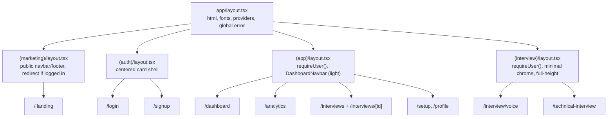

# 05 — Routing & Layout Plan

Every route, its access posture, rendering mode, and the layout it lives under. Also covers the layout hierarchy, loading boundaries, and error boundaries (brief §5, §13, §14).

---

## 1. Route map (current → target)

| Current (React Router) | Target (App Router) | Group | Access | Rendering |
|---|---|---|---|---|
| `/login` | `/login` | `(auth)` | Public | Static shell + client form |
| `/signup` | `/signup` | `(auth)` | Public | Static shell + client form |
| `/` (HeroPage, **protected today**) | `/` → marketing **or** redirect | `(marketing)` | **Public** (changed) | Static |
| `/dashboard` (DashboardDemo) | `/dashboard` | `(app)` | Protected | Dynamic, streamed |
| `/roles` | `/setup` (merge) or `/roles` | `(app)` | Protected | Static shell + client form |
| `/setup` | `/setup` | `(app)` | Protected | Static shell + client form |
| `/interview/voice` | `/interview/voice` | `(interview)` | Protected | Dynamic shell + client island |
| `/technical-interview` | `/technical-interview` | `(interview)` | Protected | Dynamic shell + client island |
| `/analytics` | `/analytics` | `(app)` | Protected | Dynamic, streamed |
| `/interviews` | `/interviews` | `(app)` | Protected | Dynamic, cached+tagged |
| `/interviews/:id` | `/interviews/[id]` | `(app)` | Protected | Dynamic, `notFound()` |
| `/replay` (router-state) | **removed** | — | — | Replaced by `/interviews/[id]` |
| n/a | `/profile` | `(app)` | Protected | Dynamic + Server Action |
| n/a | `/auth/callback` | — | Public | Route Handler |
| n/a | `/api/*` | — | Mixed | Route Handlers |

### Notable routing changes & why
- **`/` becomes public marketing.** Today the hero is behind `ProtectedRoute`, which is wrong for a landing page and kills SEO. Public landing is the single biggest server-render/SEO win. Authenticated users hitting `/` can be redirected to `/dashboard` in the marketing layout (server-side check). See [14](./14-seo-metadata.md).
- **`/replay` is deleted.** It existed only to replay the just-finished interview from `location.state`. Since `evaluateInterview` returns the persisted `id`, we redirect to `/interviews/[id]` instead — refresh-safe and shareable.
- **`/roles` likely merges into `/setup`.** Role is one field of setup config; a separate route adds a navigation hop. Keep only if role selection is a distinct onboarding step ([open question](./17-open-questions.md)).
- **`[id]` is a dynamic segment**, owner-scoped on the server; `notFound()` renders `not-found.tsx` instead of a client 404.

---

## 2. Layout hierarchy

### Layout responsibilities

| Layout | Responsibility |
|---|---|
| **Root** (`app/layout.tsx`) | `<html lang>`, font optimization (`next/font`), global client providers (toasts), base Tailwind. Server Component. |
| **`(marketing)`** | Public chrome; server check: if session exists, `redirect('/dashboard')`. Fully static otherwise. |
| **`(auth)`** | Centered auth shell; if already authenticated, `redirect('/dashboard')`. |
| **`(app)`** | **Auth gate**: `requireUser()` (server) → redirect to `/login` if absent. Renders shared `DashboardNavbar` (light variant) once for all child pages — a **persistent layout** (nav doesn't remount on navigation). |
| **`(interview)`** | Auth gate + **distraction-free** full-height chrome (current `h-screen` pattern). Compact/dark navbar variant. |

**Persistent layouts**: putting `DashboardNavbar` in `(app)/layout.tsx` means it renders once and survives client navigations between dashboard/analytics/interviews — matching the current "navbar on every page" rule but without re-rendering it per page.

---

## 3. Auth gating placement

Two layers, defense in depth (detailed in [08](./08-authentication.md)):

1. **`middleware.ts`** — refreshes the Supabase session cookie on every request and redirects unauthenticated requests away from protected paths *before* any render. This replaces the client `ProtectedRoute` spinner.
2. **`(app)`/`(interview)` layout** — `requireUser()` server call as a second guard and to provide the user object to children.

Result: no flash-of-loading, no client-side protected-route logic, content never renders for anonymous users.

---

## 4. Loading boundaries (`loading.tsx`) — brief §13

Place a `loading.tsx` beside any route that does server data work, so navigation shows an instant skeleton while the RSC awaits data.

| Route | `loading.tsx` content |
|---|---|
| `/dashboard` | Metric-card + chart skeleton |
| `/analytics` | Chart skeleton + result-card skeleton |
| `/interviews` | List-row skeletons (repeat the card shape) |
| `/interviews/[id]` | Header skeleton + transcript-line skeletons |
| `/profile` | Form skeleton |
| `/setup` | Light — mostly static; optional |
| Interview routes | The "Preparing your coding problems…" / "Connecting…" states stay **inside the client island** (they reflect call state, not route load), but a `loading.tsx` covers the server problem-fetch for the technical route. |

Skeletons should mirror final layout dimensions to avoid CLS. See [10](./10-streaming-loading.md) for Suspense-level streaming within a page.

---

## 5. Error boundaries (`error.tsx`) — brief §14

| Boundary | Scope | Handles |
|---|---|---|
| `app/global-error.tsx` | Whole app (replaces root layout on crash) | Catastrophic render errors |
| `(app)/error.tsx` | All authenticated pages | Server read failures, unexpected exceptions; offers retry (`reset()`) |
| `(app)/interviews/[id]/` → `not-found.tsx` | Single replay | **Expected** miss (bad/foreign id) → friendly 404, *not* an error |
| `(interview)/error.tsx` | Live interview routes | Problem-generation/setup failures with a "back to setup" recovery |
| Client islands | In-island try/catch + local error state | Vapi connection errors, code-exec errors (already handled today) |

**Expected vs unexpected:**
- *Expected* failures (interview not found, foreign id, empty history) → `notFound()` / empty states, handled in the Server Component. No `error.tsx`.
- *Unexpected* failures (OpenAI down, Supabase error, network) → bubble to `error.tsx` with a retry button.

The current Express centralized error handler ("never leak internals") maps to: Server Actions/Handlers return typed `{ error }` without internals; `error.tsx` shows a generic message + logs server-side.

---

## 6. Navigation patterns

- Replace `useNavigate()` with `<Link>` for navigation and `redirect()` (server) / `useRouter().push()` (client) for programmatic moves.
- Replace `location.state` config passing with: **Server Action persists setup** → redirect to interview route which **reads it server-side**, OR encode minimal config in `searchParams`. See [07](./07-data-flow.md), [17](./17-open-questions.md).
- Post-evaluation: Server Action returns `{ id }` → client island calls `router.push('/interviews/' + id)` (or `redirect` from the action).
