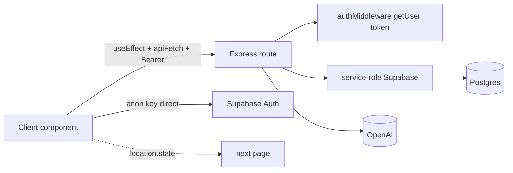
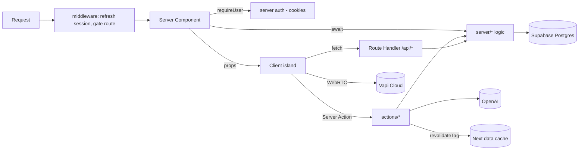
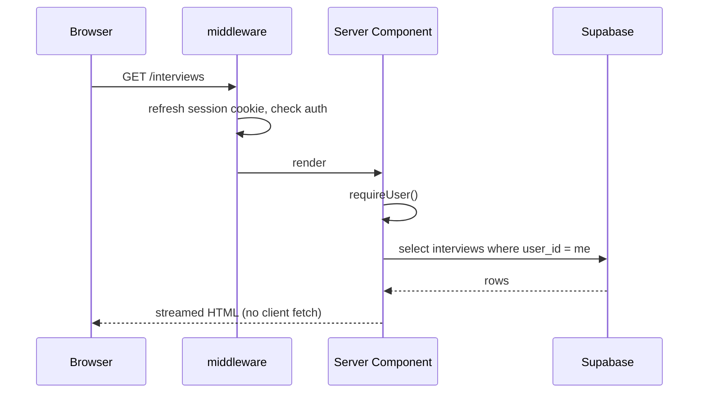
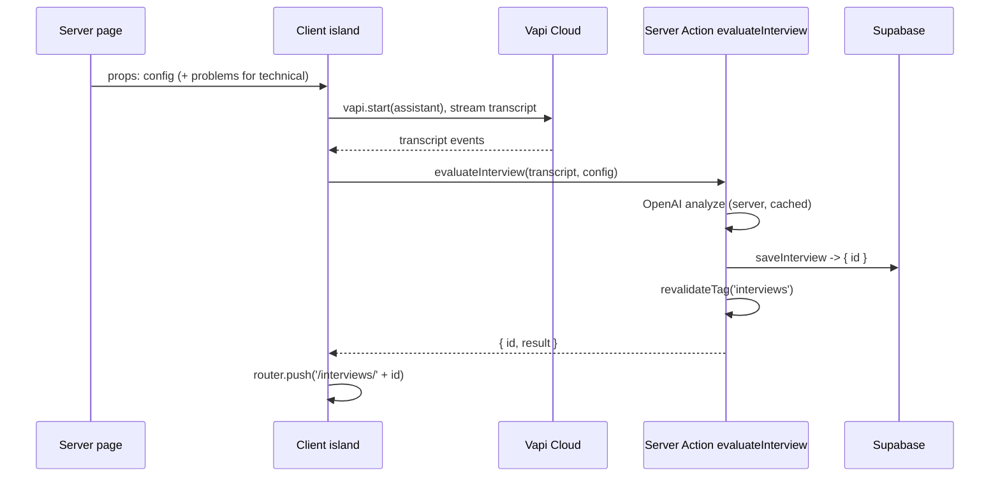
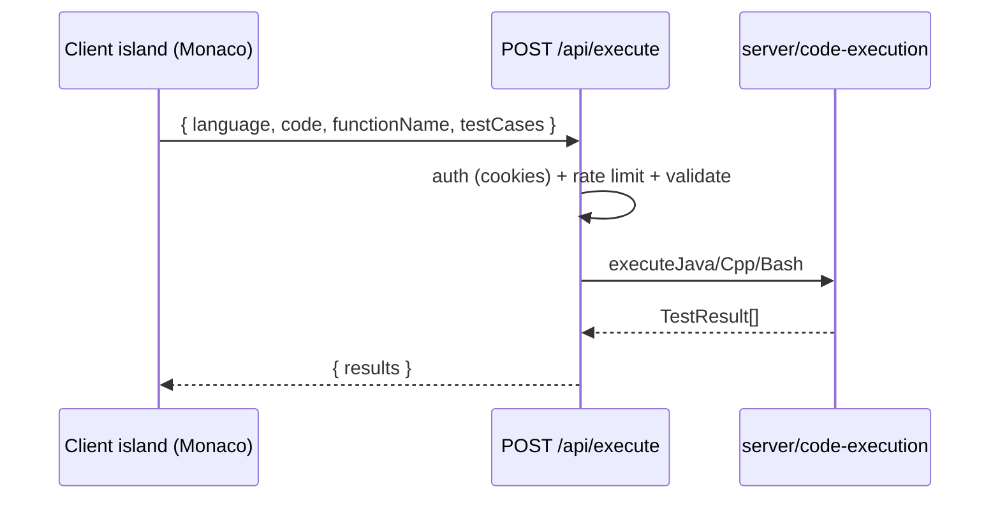

# 07 — Data Flow Architecture

How data moves in the rebuild, contrasted with today.

---

## 1. Current data flow

Every initial page load is: render → `useEffect` → `apiFetch` → Express → service-role Supabase → back → `setState` → re-render. Config hops between pages via in-memory router state.

## 2. Target data flow

**Reads** happen on the server during render. **Mutations** go through Server Actions. **Machine/stream/poll** go through Route Handlers. The client island receives data as props and only talks back for mutations or browser-only work.

---

## 3. Three canonical flows

### A. Viewing data (history, replay, dashboard) — pure server read

No `useEffect`, no spinner-then-data, no over-fetch. `loading.tsx` covers the await.

### B. Running + evaluating an interview — client island + Server Action

Replaces `POST /evaluate` + `navigate('/analytics', {state})`. The result is **persisted and addressable** before navigation.

### C. Code execution (compiled langs) — Route Handler

JS/TS/Python never leave the browser; only Java/C++/Bash hit this handler.

---

## 4. Configuration flow (the `location.state` replacement)

**Problem today:** setup config lives in `location.state` — lost on refresh, invisible to the server, not shareable.

**Target options** (pick one; see [17](./17-open-questions.md)):

| Option | Mechanism | Pros | Cons |
|---|---|---|---|
| **A. Persisted draft (recommended)** | `SetupForm` → Server Action `saveSetupDraft(config)` writes a `draft_config` (cookie or a `interview_drafts` row) → redirect to interview route → server reads it | Refresh-safe; server-resolvable; clean URLs | Adds a tiny persistence step |
| **B. URL searchParams** | Encode config in query string; interview page reads `searchParams` | Shareable, stateless, deep-linkable | Long URLs; must validate/whitelist values |
| **C. Cookie only** | Store config in an httpOnly cookie at submit | Simple | Not shareable; one active config at a time |

Either way, the interview Server Component **resolves config on the server** and hands a typed object to the client island. No more `location.state as {...}` casts.

---

## 5. Auth/session data flow

- **Session lives in cookies** (via `@supabase/ssr`), refreshed in `middleware.ts`.
- Server reads the user with a request-scoped client (`server/db/server-client.ts`) — no synchronous client cache needed.
- The browser anon client (`lib/supabase/client.ts`) is used only inside client auth forms and the Vapi flow if it needs a token. See [08](./08-authentication.md).

---

## 6. What gets simpler

| Concern | Before | After |
|---|---|---|
| Initial data | client fetch waterfall | server read at render |
| Auth token plumbing | `apiFetch` attaches Bearer per call | cookies, automatic |
| Cross-page config | `location.state` (fragile) | persisted draft / searchParams |
| "Fresh result" handoff | router state + fallback fetch | persisted `id` + redirect |
| Type duplication | FE + BE copies | single `types/` |
| CORS | configured allow-list | gone (same origin) |
