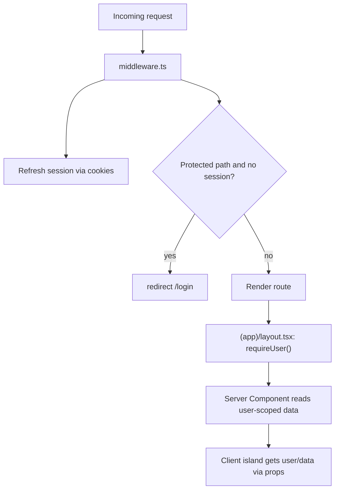
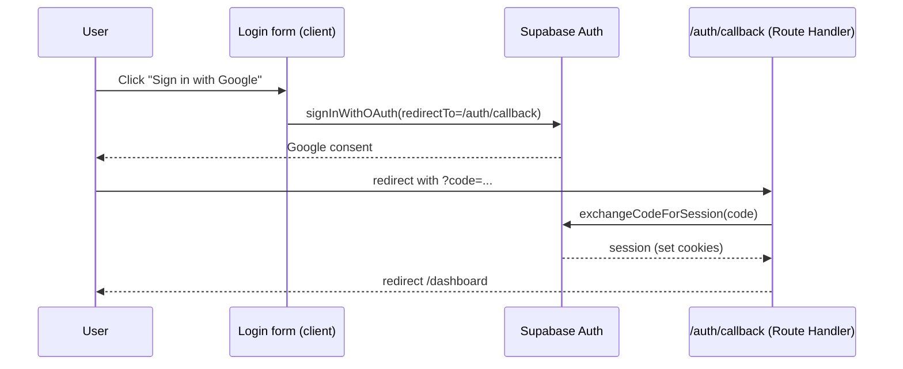

# 08 — Authentication

A modern, server-aware Supabase auth strategy. Keeps Supabase as the identity provider (project rule: no custom login/signup backend) but moves session handling from a client-only SPA model to cookie-based SSR.

---

## 1. Current model (recap)

- **Frontend** owns auth via `@supabase/supabase-js`: `signInWithPassword`, `signUp` (+ `profiles` upsert), `signInWithOAuth` (Google/GitHub), `signOut`.
- Session persisted by the SDK (IndexedDB/localStorage); a synchronous `_cachedUser` is warmed from `getSession()` and kept current via `onAuthStateChange`.
- `apiFetch()` reads the live token and sends `Authorization: Bearer <token>`; 401 → hard redirect to `/login`.
- `ProtectedRoute` checks `getSession()` **after mount** (spinner, then redirect).
- **Backend** `authMiddleware` verifies the token with `supabase.auth.getUser(token)`.

**Weaknesses:** auth check happens after render (flash); session is client-only and invisible to the server; protected logic runs in the browser.

---

## 2. Target model: `@supabase/ssr` + middleware + server reads



### Pieces

1. **`lib/supabase/client.ts`** — browser client (anon key) for client-side auth UI and any client token needs.
2. **`server/db/server-client.ts`** — request-scoped server client wired to Next.js `cookies()`; reads/refreshes the session server-side.
3. **`server/db/admin.ts`** — service-role client (bypasses RLS) for privileged operations only.
4. **`middleware.ts`** — on every matched request: refresh the auth cookie and gate protected routes.
5. **`server/auth.ts`** — `getUser()` (nullable) and `requireUser()` (redirects if absent) helpers used in layouts/pages/actions.
6. **`/auth/callback/route.ts`** — exchanges the OAuth `code` for a session and sets cookies.

---

## 3. Middleware (route gating + session refresh)

```ts
// middleware.ts (shape, not final code)
export async function middleware(req: NextRequest) {
  const res = NextResponse.next();
  const supabase = createServerClient(/* env */, { cookies: bindTo(req, res) });
  const { data: { user } } = await supabase.auth.getUser(); // refreshes session

  const isProtected = matchesProtected(req.nextUrl.pathname); // (app) + (interview) + /api authed
  if (isProtected && !user) {
    return NextResponse.redirect(new URL("/login", req.url));
  }
  if (isAuthPage(req.nextUrl.pathname) && user) {
    return NextResponse.redirect(new URL("/dashboard", req.url));
  }
  return res;
}

export const config = {
  matcher: ["/((?!_next/static|_next/image|favicon.ico|.*\\.(?:svg|png|jpg)).*)"],
};
```

> **Use middleware only for what it's good at**: cheap cookie refresh + coarse redirects. Do **not** put DB queries or authorization logic in middleware. Fine-grained authorization (does this user own this interview?) stays in Server Components / Actions / Route Handlers via owner-scoped queries — exactly as the current code does with `.eq('user_id', ...)`.

---

## 4. Protected layouts (second guard + user provisioning)

```ts
// app/(app)/layout.tsx (shape)
export default async function AppLayout({ children }) {
  const user = await requireUser();          // redirects to /login if null
  return (
    <div className="min-h-screen ...">
      <DashboardNavbar user={user} />
      {children}
    </div>
  );
}
```

`(interview)/layout.tsx` does the same with minimal chrome. This guarantees content never renders for anonymous users and provides `user` to the subtree without a client cache.

---

## 5. Login / signup / OAuth

- **Forms are Client Components** (need input state). They either:
  - call the **browser Supabase client** directly (`signInWithPassword`, `signUp`, `signInWithOAuth`) — closest to current behavior, OR
  - call **Server Actions** (`signIn`, `signUp`) that use the server client and set cookies.
- **Signup** also upserts the `profiles` row (current behavior). This can move into a Server Action (using service-role) or a Postgres trigger on `auth.users` insert ([open question](./17-open-questions.md)) — a trigger is cleaner and avoids client-side profile writes.
- **OAuth** (`redirectTo` → `/auth/callback`): the callback Route Handler exchanges the code and redirects to `/dashboard`.



---

## 6. Session management & 401 handling

- **Sessions in httpOnly cookies**, refreshed by middleware — no localStorage, no synchronous cache hack, satisfies the project rule "do not use localStorage for auth state."
- **Sign-out** is a Server Action (or client call) that clears cookies and `redirect('/login')`.
- **Expired/invalid session**: middleware fails the refresh → redirect to `/login`. Server reads that hit an unauthenticated state call `redirect('/login')` via `requireUser()`. No more per-`fetch` 401 interception.

---

## 7. Authorization boundaries

Unchanged in spirit, enforced server-side:

- Every interview query is owner-scoped: `.eq('user_id', user.id)`.
- Single-resource fetches return `notFound()` for missing **or** foreign ids (mirrors current 404-on-not-owner to prevent enumeration).
- Job polling checks `job.userId === user.id` (current behavior, now in the Route Handler).
- Role updates validate against the allow-list (current `VALID_ROLES`).

**RLS still applies**: the request-scoped server client respects RLS; the admin client bypasses it and is used only where the server has already authorized the user. See [13](./13-database.md).

---

## 8. Migration notes / gotchas

- Token verification moves from `authMiddleware` to middleware + server clients; the `req.user` pattern becomes `await getUser()`.
- Vapi: if the voice flow needs a Supabase token client-side, get it from the browser client; otherwise it doesn't need one (Vapi uses its own public key).
- Keep the `VALID_ROLES` allow-list and `profiles` shape identical to avoid schema churn.
