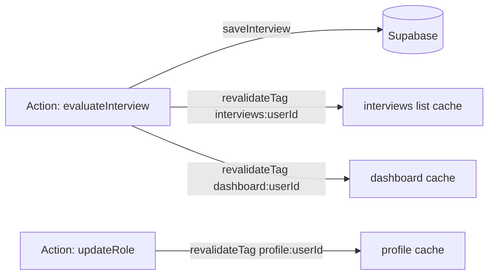

# 09 — Caching Strategy

The current app caches at the service layer (`cacheService` get-or-compute, in-memory or Redis; AI results 1h/24h, dashboard 60s). The rebuild maps these onto Next.js's caching primitives plus tag-based invalidation.

---

## 1. Caching layers in Next.js 16

| Layer | What it caches | Control |
|---|---|---|
| **Data Cache** (`unstable_cache` / `fetch` cache) | Results of server data functions / fetches | `revalidate`, `tags` |
| **Full Route Cache** | Rendered output of static routes | static vs dynamic; `revalidate` |
| **Request memoization** | Same call within one render pass | automatic |
| **Router/client cache** | Client-side navigation results | framework-managed |

> Next.js 16 defaults are **less aggressive** than older versions (more is dynamic/uncached unless you opt in). So caching here is largely **opt-in** via `unstable_cache` and explicit `revalidate`. Treat user-specific data as dynamic by default and cache deliberately.

---

## 2. Mapping current caches → Next.js

| Current | TTL | Rebuild |
|---|---|---|
| `analyzeVapiTranscript` (cacheService) | 1h | `unstable_cache(fn, key, { revalidate: 3600, tags:['analysis'] })` keyed on transcript+config hash |
| `generateInterviewQuestions` | 24h | `unstable_cache(..., { revalidate: 86400, tags:['questions', role,difficulty,level,language] })` |
| `buildDashboard` (route, 60s) | 60s | `unstable_cache(buildDashboard, ['dashboard', userId], { revalidate: 60, tags:['dashboard:'+userId] })` |
| `cacheService` in-flight dedup | — | React request memoization covers per-render dedup; cross-request dedup handled by the Data Cache |

The hand-rolled `cacheService` (in-memory/Redis get-or-compute) is **replaced** by `unstable_cache`. If multi-instance deployment requires a shared cache, configure a Next.js cache handler backed by Redis (analogous to the current optional `REDIS_URL`).

---

## 3. Per-surface caching decisions

| Surface | Cache? | Strategy | Reasoning |
|---|---|---|---|
| Landing / marketing | **Aggressive** | Static, long-lived | No per-user data; rarely changes |
| Login / signup | Static shell | Shell cached; auth dynamic | No data |
| **Question generation** | **Aggressive (24h)** | `unstable_cache` keyed on role/difficulty/level/language | Same inputs → same problem set is desirable and expensive to regen |
| **Transcript evaluation** | **Moderate (1h)** | `unstable_cache` keyed on transcript+config | Deterministic for identical transcript; protects against duplicate evaluate calls |
| Dashboard aggregate | **Short (60s)** per user | tag `dashboard:{userId}` | Matches current 60s; cheap freshness |
| Interviews list | **Tagged, no TTL** | tag `interviews:{userId}`, invalidate on new interview | Changes only when an interview is saved |
| Replay `[id]` | **Tagged/long** | tag `interview:{id}` | Immutable once created (transcript/result don't change) |
| Profile | **Tagged** | tag `profile:{userId}`, invalidate on role update | Changes only on explicit edit |
| **Auth/session** | **Never** | always dynamic | Security-critical, per-request |
| **Code execution** | **Never** | dynamic | Side-effecting, input-specific |
| Job status poll | **Never** | dynamic | Changes every poll |

---

## 4. Tag-based invalidation

Tag writes so reads stay cached until something actually changes.

| Mutation | `revalidateTag` calls |
|---|---|
| `evaluateInterview` (save) | `interviews:{userId}`, `dashboard:{userId}` |
| `updateRole` | `profile:{userId}` |
| (async job completes) | worker can't call `revalidateTag` directly — use a small revalidation Route Handler hit on completion, or rely on the short dashboard TTL |

> **Async-job caveat:** Next.js cache revalidation runs inside the Next runtime. A separate worker process completing a job should trigger revalidation via an internal authenticated Route Handler (`POST /api/internal/revalidate`) or simply let the 60s dashboard TTL pick it up. See [12](./12-api-migration.md).

---

## 5. Static vs dynamic rendering

| Render mode | Routes |
|---|---|
| **Static** | `/` (landing), auth shells, any purely informational page |
| **Dynamic** | everything per-user: dashboard, analytics, interviews, replay, profile, interview routes |

Per-user pages are dynamic because they depend on the session cookie. Within them, the **data** can still be cached (tags/TTL) even though the **render** is dynamic — that's the key distinction: dynamic render + cached data fetch.

---

## 6. Data that must never be cached

- Session/user identity reads tied to the request.
- Code execution results.
- Job polling responses.
- Anything where staleness is a security or correctness risk.

For these, ensure no `unstable_cache` wrapping and treat the route as dynamic (it already is, being cookie-dependent).

---

## 7. Cache key hygiene

- Always include `userId` in per-user cache keys/tags to prevent cross-user leakage.
- For AI caches, hash the full input (transcript+config / role+difficulty+level+language) exactly as `generateCacheKey` does today.
- Never include secrets in cache keys.
