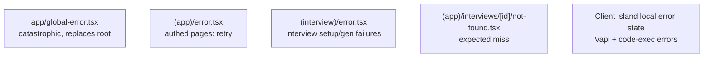
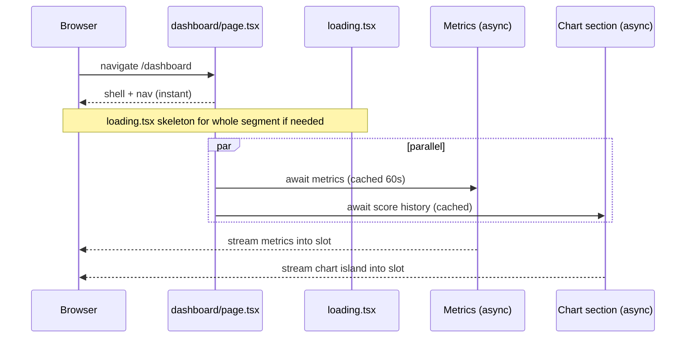

# 10 — Streaming, Loading UI & Error Handling

Combines brief §12 (Streaming), §13 (Loading UI), and §14 (Error Handling).

---

## 1. Streaming — where it helps

Streaming lets the server send the shell immediately and fill slower sections as their data resolves. Use it where a page has **fast static parts + slow data parts**.

| Page | Stream what | Suspense boundary around | UX benefit |
|---|---|---|---|
| **Dashboard** | Shell + nav instant; metrics and chart stream in | `<MetricsCards>`, `<ScoreTrendChart>` separately | User sees layout immediately; numbers/chart pop in independently |
| **Analytics** | Header instant; aggregate + chart stream | `<Analytics>` data section | No full-page spinner |
| **Interviews list** | Page heading instant; list streams | `<InterviewList>` | Instant chrome |
| **Replay `[id]`** | Score summary can load before/with transcript | `<TranscriptTimeline>` separately from `<ScoreSummary>` | Scores visible while transcript hydrates |
| **Technical interview** | Route shell instant; "Preparing problems…" while `generateQuestions` resolves on server | `<TechnicalInterviewClient>` (awaits problems) | Replaces today's client-side loading spinner with a streamed server boundary |

### Pattern

```tsx
// app/(app)/dashboard/page.tsx
export default function DashboardPage() {
  return (
    <>
      <DashboardHeader />                 {/* instant */}
      <Suspense fallback={<MetricsSkeleton />}>
        <Metrics />                       {/* async server component */}
      </Suspense>
      <Suspense fallback={<ChartSkeleton />}>
        <ScoreTrendSection />             {/* awaits aggregate, renders client chart */}
      </Suspense>
    </>
  );
}
```

### Independently loadable sections
The dashboard has two independent data needs: **user metrics** and **score history**. Wrapping each in its own `<Suspense>` lets them resolve in parallel and render as they arrive, instead of blocking on the slowest. Parallel data fetching (kick off both `await`s without serial dependency) is the companion technique — see [15](./15-performance.md).

---

## 2. Loading UI (`loading.tsx`) — skeleton screens

A `loading.tsx` is an automatic Suspense fallback for the whole route segment while its async server work runs. Place one beside every data-driven route.

| Route | Skeleton |
|---|---|
| `/dashboard` | 4 metric-card rectangles + chart placeholder + 3 recent-row bars |
| `/analytics` | Chart placeholder + score-breakdown bars + result-card |
| `/interviews` | 6 repeated list-row skeletons matching the interview-card shape |
| `/interviews/[id]` | Header bar + 8 alternating transcript-line skeletons (assistant/candidate) |
| `/profile` | Avatar circle + 2 input bars + button |
| `/technical-interview` | Centered "Preparing your coding problems…" with spinner (server problem-fetch) |

**Skeleton principles:**
- Mirror final dimensions → zero layout shift (CLS).
- Reuse the real component's container classes with `animate-pulse` placeholders.
- Keep the dark/light gradient backgrounds consistent with the destination page.

> Distinguish **route loading** (`loading.tsx`, server data) from **call-state loading** (Vapi "Connecting…", "Analyzing…") which stays *inside the client island* because it reflects live WebRTC state, not route data.

---

## 3. Error handling (`error.tsx`, `not-found.tsx`, `global-error.tsx`)

### Boundary hierarchy



| Boundary | Catches | Recovery |
|---|---|---|
| `global-error.tsx` | Errors in the root layout itself | Full reload |
| `(app)/error.tsx` | Server read/render failures in dashboard, analytics, interviews, profile | `reset()` retry button + link home |
| `(interview)/error.tsx` | Problem-generation/config failures | "Back to setup" + retry |
| `not-found.tsx` (replay) | `notFound()` from a missing/foreign interview id | Link to `/interviews` |
| Client islands | Vapi connection errors, code-exec errors | Already handled locally today (error message state, recover to `idle`) — preserved |

### Expected vs unexpected

| Class | Example | Handling |
|---|---|---|
| **Expected** | Interview not found, empty history, foreign id | Server returns `notFound()` or renders an **empty state** — never an error screen |
| **Unexpected** | OpenAI/Supabase outage, network error | Throw → nearest `error.tsx` → generic message; **log internals server-side only** |

This preserves the current backend rule "never leak internals": Server Actions/Handlers return `{ error: "Failed to ..." }` (generic), the real cause is `console.error`'d server-side, and `error.tsx` shows a friendly message + retry.

### Server Action / Route Handler errors
- Actions return a typed discriminated result (`{ ok: true, data }` | `{ ok: false, error }`) so the client island can show inline feedback without throwing.
- Truly unexpected throws inside an Action bubble to the nearest error boundary.

---

## 4. Putting it together — dashboard example



If metrics throw, only that Suspense subtree falls to its error boundary; the rest of the dashboard still renders.
