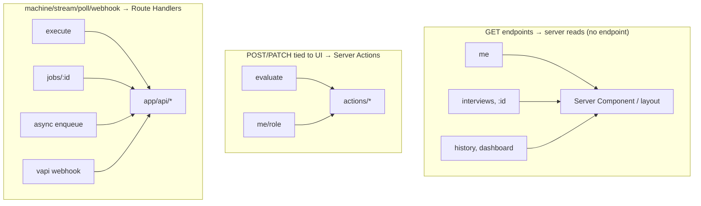
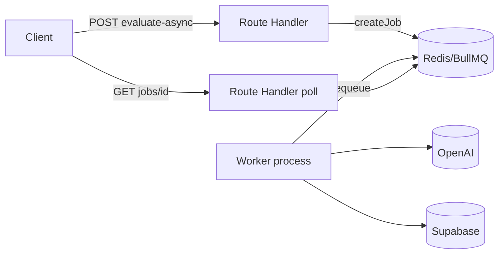

# 12 — API Migration

Endpoint-by-endpoint disposition of the current Express API. Each becomes a **Server Action**, a **Route Handler**, stays **external**, or is **dropped**.

---

## 1. Full migration table

| Current endpoint | Method | Auth | Disposition | Target | Why |
|---|---|---|---|---|---|
| `/` | GET | public | **Drop** | — | Health check; Next has its own |
| `/api/auth/me` | GET | yes | **Server read** | `server/auth.ts` + profile query in RSC | It's a read; do it in the layout/page, not an endpoint |
| `/api/auth/me/role` | PATCH | yes | **Server Action** | `updateRole` | Mutation tied to a form |
| `/api/analysis/questions` | POST | yes | **Server util / Action** | `server/ai/questions` (awaited in technical page) | Called during server render; secret-bearing |
| `/api/analysis/evaluate` | POST | yes | **Server Action** | `evaluateInterview` | Mutation + secret, UI-triggered |
| `/api/analysis/questions/async` | POST | yes | **Route Handler** | `POST /api/analysis/questions-async` | Returns job id for polling |
| `/api/analysis/evaluate/async` | POST | yes | **Route Handler** | `POST /api/analysis/evaluate-async` | Returns job id for polling |
| `/api/analysis/history` | GET | yes | **Server read** | query in `analytics`/`interviews` RSC | Read; no endpoint needed |
| `/api/interviews` | GET | yes | **Server read** | query in `interviews/page.tsx` | Read |
| `/api/interviews/:id` | GET | yes | **Server read** | query in `interviews/[id]/page.tsx` | Read |
| `/api/execute` | POST | yes | **Route Handler** | `POST /api/execute` | Machine endpoint called by client code-runner |
| `/api/jobs/:id` | GET | yes | **Route Handler** | `GET /api/jobs/[id]` | Polled status endpoint |
| `/api/analytics/dashboard` | GET | yes | **Server read** (cached) | `server/analytics.buildDashboard` in RSC | Read + cache via `unstable_cache` |
| `/api/vapi/*` | POST | public | **Route Handler** | `POST /api/vapi/[...path]` | External webhook |
| `/api/start`, `/api/next` | POST | yes | **Drop** | — | Legacy text interview, superseded by Vapi ([confirm](./17-open-questions.md)) |

---

## 2. The pattern: reads disappear, mutations become actions, machines become handlers

**Rule of thumb:** if a browser React component would have called it as a mutation → Server Action. If something *non-React* calls it (the Vapi cloud, a polling loop, a WASM runtime POSTing code) → Route Handler. If it was a GET feeding a page → delete it and read in the Server Component.

---

## 3. Route Handlers that survive

### `POST /api/execute` (`app/api/execute/route.ts`)
- Auth via server client (cookies), not Bearer.
- Reintroduce rate limiting + body validation (current `validateCodeExecution`, `executeLimiter`).
- Body `{ language, code, functionName, testCases }` → `server/code-execution` → `{ results }`. Unchanged logic.

### `GET /api/jobs/[id]` (`app/api/jobs/[id]/route.ts`)
- Owner check `job.userId === user.id`, 404 on miss/foreign (current behavior).
- Returns `{ id, type, status, result?|error? }`.

### `POST /api/analysis/evaluate-async`, `questions-async`
- Validate, enqueue via `server/jobs/jobService.createJob`, return `202 { jobId, status }`.
- Backed by the **separate worker process** (`pnpm worker`). See §5.

### `POST /api/vapi/[...path]` (public)
- Verify Vapi signature before processing.
- **Audit first**: confirm what (if anything) currently consumes these webhooks before porting ([open question](./17-open-questions.md)).

### `GET /auth/callback` — OAuth code exchange (see [08](./08-authentication.md)).

### (internal) `POST /api/internal/revalidate`
- New: lets the out-of-process worker trigger `revalidateTag` on job completion. Protected by a shared secret. Optional — the 60s dashboard TTL is an alternative. See [09](./09-caching.md).

---

## 4. Cross-cutting Express middleware → Next.js equivalents

| Express | Rebuild |
|---|---|
| `helmet()` | `headers()` in `next.config.ts` (CSP, etc.) |
| CORS allow-list | **Gone** — same-origin app. Keep CORS only on `/api/vapi/*` and any truly external handler |
| `express.json({ limit: '1mb' })` | Validate body size in handlers/actions; configure body limits where supported |
| `globalLimiter`/`authLimiter`/`aiLimiter`/`executeLimiter` | Middleware or per-action rate-limit guard ([11](./11-server-actions.md) §5) |
| Centralized error handler | `error.tsx` boundaries + typed Action/Handler errors ([10](./10-streaming-loading.md)) |
| `authMiddleware` | `middleware.ts` + `requireUser()` |
| `validate.ts` | per-Action/Handler input validation (zod) |

---

## 5. Jobs & worker — deployment reality

The current worker runs **in-process** with Express (`startWorker()` in `index.ts`). Next.js has no long-lived in-process worker model that survives serverless/edge deploys.

**Recommendation:**
- Keep `server/jobs/*` and `worker.ts`, but run the worker as a **separate Node process** (`pnpm worker`) alongside the Next app (e.g., a second container/service), backed by **Redis/BullMQ**.
- Enqueue from Route Handlers; poll via `GET /api/jobs/[id]`.
- For an MVP that doesn't need async, the **synchronous Server Action path** (`evaluateInterview`) is sufficient and the worker is **P2**. See [02](./02-feature-inventory.md) F12.

---

## 6. What clients call now (summary)

| Client island action | Calls |
|---|---|
| End interview → evaluate | Server Action `evaluateInterview` |
| Run Java/C++/Bash | `fetch('/api/execute')` |
| (optional) async evaluate + poll | `fetch('/api/analysis/evaluate-async')` → poll `fetch('/api/jobs/[id]')` |
| Update role | Server Action `updateRole` |
| Submit setup | Server Action `saveSetupDraft` → redirect |

Page data (history, replay, dashboard, profile) is **not fetched by clients at all** — it's read on the server during render.
