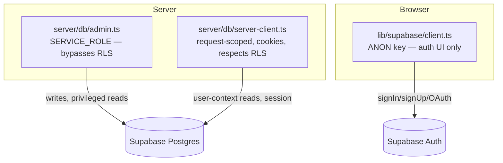

# 13 — Database Access

Where database access lives in the rebuild, the schema (unchanged), and the two-client model.

> **Constraints carried over:** Supabase client only — no Prisma/Drizzle/ORM, no migration tooling, no raw `pg`/Pool. Service-role access stays server-only.

---

## 1. Where DB access happens

| Operation | Current | Rebuild location | Client used |
|---|---|---|---|
| List interviews | `interviews.ts` GET / | `interviews/page.tsx` (RSC) | server (user or admin) |
| Single interview | `interviews.ts` GET /:id | `interviews/[id]/page.tsx` (RSC) | server |
| Save interview | `storageService.saveInterview` | `actions/interview.ts` → `server/storage` | **admin** |
| Read profile | `auth.ts` GET /me | `(app)/layout.tsx` / `profile/page.tsx` | server |
| Update role | `auth.ts` PATCH /me/role | `actions/profile.ts` → `server/storage` | **admin** |
| Dashboard rows | `analyticsService.fetchUserInterviewRows` | `server/analytics` in RSC | server |
| Signup profile upsert | client `auth.ts` | Server Action or DB trigger | **admin**/trigger |
| Token verification | `authMiddleware` | middleware + server client | server |

**Principle:** all DB access is **server-side** (RSC, Server Action, Route Handler, worker). No client component ever queries the database. This already matches the project rule "backend DB access via service-role client," just relocated into one app.

---

## 2. Two Supabase clients (and when to use each)



| Client | Key | Respects RLS | Use for |
|---|---|---|---|
| **admin** (`server/db/admin.ts`) | service-role | No (bypasses) | Writes (`saveInterview`, role update), reads where the server has already authorized the user |
| **server** (`server/db/server-client.ts`) | anon + session cookie | Yes | User-context reads in RSCs; session/auth resolution |
| **browser** (`lib/supabase/client.ts`) | anon | Yes | Client auth forms, OAuth, Vapi token if needed |

> The current backend uses **only** the service-role client and enforces ownership manually with `.eq('user_id', ...)`. The rebuild can keep that exact approach (admin client + manual scoping) **or** lean on RLS via the server client for reads. Recommendation: **admin client + explicit `.eq('user_id', user.id)`** for parity and predictability, with RLS as defense-in-depth. Never expose service-role to the browser.

---

## 3. Schema (unchanged)

```sql
public.profiles (
  id          uuid PRIMARY KEY,        -- mirrors auth.users.id
  email       text,
  name        text,
  role        text DEFAULT 'fullstack',
  created_at  timestamptz
)

public.interviews (
  id             uuid PRIMARY KEY DEFAULT gen_random_uuid(),
  user_id        uuid REFERENCES auth.users(id),
  role           text,
  question_type  text,                 -- 'behavioral' | 'technical'
  config         jsonb,                -- VapiInterviewConfig
  result         jsonb,                -- VapiAnalysisResult
  transcript     jsonb,                -- TranscriptEntry[]
  created_at     timestamptz,
  -- metrics columns written by saveInterview:
  started_at     timestamptz,
  completed_at   timestamptz,
  duration_ms    bigint,
  question_count int,
  success        boolean,
  error          text
)
```

The metrics columns (`started_at`, `completed_at`, `duration_ms`, `question_count`, `success`, `error`) are written by `storageService.saveInterview` and read by `analyticsService`. Preserve them.

---

## 4. Critical conventions to preserve

| Convention | Detail |
|---|---|
| **`created_at → date` mapping** | `rowToInterview` and the interviews route alias `created_at` to `date` for the frontend `SavedInterview` type. Keep this mapping in `server/storage` so existing UI shapes hold. |
| **Column selection** | `COLUMNS = "id, created_at, role, question_type, config, result, transcript"`. The list route omits `transcript`; keep that distinction (list vs detail) for payload size. |
| **Owner scoping** | Every interview query: `.eq('user_id', user.id)`. Single fetch: `.eq('id', id).eq('user_id', user.id).single()` → `notFound()` on error. |
| **Error sanitization** | `sanitizeError` truncates and strips paths before persisting `error`. Keep — it feeds the dashboard. |
| **`maybeSingle` vs `single`** | `getLatestInterview` uses `maybeSingle`; detail fetch uses `single`. Preserve semantics. |

---

## 5. RLS

RLS is enabled on `profiles` and `interviews`. Two implications:

1. The **server client** (cookie session) reads under RLS — policies must allow a user to read their own rows.
2. The **admin client** bypasses RLS — it must only run after the server has authenticated the user, and must always scope by `user.id`.

**Recommended policies** (if not already present): `select/insert/update` on `interviews` and `profiles` where `auth.uid() = user_id` / `auth.uid() = id`. This makes the server-client path safe even without manual scoping, and keeps the admin path as the privileged exception.

---

## 6. Profile creation on signup

Today the **client** upserts the `profiles` row right after `signUp`. Two cleaner rebuild options:

| Option | How | Trade-off |
|---|---|---|
| **DB trigger (recommended)** | `on auth.users insert` → insert into `profiles` | No client/server write needed; atomic; survives any signup path |
| **Server Action** | `signUp` action upserts via admin client | Explicit; keeps logic in app code |

Avoid keeping the client-side write — it's a privileged-ish operation better handled server/DB-side.

---

## 7. Connection & runtime notes

- Supabase JS client is HTTP-based (PostgREST) — no connection pool to manage, works in serverless/edge. The `pg` dependency and Pool are **not** carried over (already forbidden).
- Instantiate the admin client once per server module; create the request-scoped server client per request (it binds to cookies).
