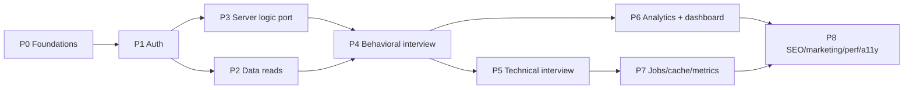

# 16 — Rebuild Roadmap & Risks

A phased plan to rebuild ACE.AI on Next.js 16, with ordering, dependencies, high-risk areas (brief §18), and a consolidated risk register (brief §19).

---

## 1. Guiding sequencing principles

1. **Foundations before features** — scaffolding, env, Supabase clients, auth, and shared types must exist before any page.
2. **Server reads before client islands** — prove the data layer with simple read pages (history/replay) before tackling the delicate Vapi islands.
3. **Highest-risk feature (voice interview) gets dedicated phases**, not squeezed in.
4. **Ship a vertical slice early** — auth → setup → behavioral interview → evaluate → replay is the core loop; get it working end-to-end before polishing analytics/jobs.

---

## 2. Phases

### Phase 0 — Foundations
- Create Next.js 16 app (App Router, TS, pnpm, Tailwind v4).
- Port `config/env.ts` (validate env, split `NEXT_PUBLIC_*` vs server secrets).
- Set up `server/db/admin.ts`, `server/db/server-client.ts`, `lib/supabase/client.ts`.
- Establish single `types/` (port `VapiInterviewConfig`, `VapiAnalysisResult`, `TranscriptEntry`, `CodingProblem`).
- Root layout, route groups (`(marketing)`, `(auth)`, `(app)`, `(interview)`), Tailwind globals, `DashboardNavbar`.
- **Exit:** app boots, env validated, empty routed shells render.

### Phase 1 — Authentication
- `@supabase/ssr` wiring, `middleware.ts` (refresh + gate), `server/auth.ts` (`getUser`/`requireUser`).
- `(auth)` login/signup forms, `/auth/callback` handler, OAuth (Google/GitHub).
- Profile creation on signup (DB trigger recommended).
- Protected `(app)`/`(interview)` layouts.
- **Exit:** can sign up/in/out; protected routes redirect anonymous users with no flash; user available server-side.
- **Depends on:** P0.

### Phase 2 — Data read pages (lowest risk, proves the model)
- Port `server/storage.ts` (interview CRUD, `created_at→date`).
- `/interviews` (list) and `/interviews/[id]` (replay) as **Server Components**; `loading.tsx`, `not-found.tsx`.
- **Exit:** existing interviews (from the shared DB) render server-side, owner-scoped, no client fetch.
- **Depends on:** P1.

### Phase 3 — Server business-logic port
- Port `server/ai/*` (prompts, `analyzeVapiTranscript`, `generateInterviewQuestions`), `server/analytics.ts`, `server/code-execution.ts`.
- Wrap AI calls in `unstable_cache` (1h/24h).
- `actions/interview.ts` (`evaluateInterview`), `actions/profile.ts` (`updateRole`), `actions/interview.ts` (`saveSetupDraft`).
- Route Handlers: `/api/execute`, (later) jobs.
- Reintroduce rate limiting + input validation (zod).
- **Exit:** actions/handlers callable and tested in isolation.
- **Depends on:** P1 (auth), P0 (types).

### Phase 4 — Behavioral interview (core loop, high risk)
- `/setup` form island → `saveSetupDraft` → redirect.
- `(interview)/interview/voice` server shell → `<VoiceInterviewClient>` (port `useVapiInterview` + `lib/vapi.ts` singleton).
- Wire end-of-call → `evaluateInterview` Action → redirect to `/interviews/[id]`.
- **Exit:** full loop works: setup → speak → transcript → evaluate → persisted replay.
- **Depends on:** P2, P3.
- **High risk:** Vapi state, audio gesture, mic permissions, real-time events.

### Phase 5 — Technical interview (highest complexity)
- Server-load problems (local bank or `generateQuestions`) in the route.
- `<TechnicalInterviewClient>`: Monaco (`dynamic ssr:false`), `use-code-execution` (JS/TS/Pyodide/remote), timer + `vapi.say()` warnings, keyboard shortcuts, "next locked until passed".
- `/api/execute` for Java/C++/Bash.
- **Exit:** technical loop works end-to-end with code execution.
- **Depends on:** P4 (shares voice island patterns), P3.
- **Highest risk:** Monaco SSR, Pyodide, regex TS-strip, gated progression, timer/voice interplay.

### Phase 6 — Analytics & dashboard
- `/dashboard` + `/analytics` server shells awaiting cached aggregate; `<ScoreTrendChart>` client island; streamed Suspense sections; skeletons.
- Remove over-fetch; tag-based revalidation on evaluate.
- **Exit:** dashboards render server-first, stream, and update after new interviews.
- **Depends on:** P2, P3.

### Phase 7 — Jobs, cache, metrics (optional/P2)
- Async evaluate/questions Route Handlers + `GET /api/jobs/[id]`.
- Separate worker process (`pnpm worker`) + Redis/BullMQ.
- `systemMetrics`; internal revalidation handler for worker completions.
- **Exit:** async path works in multi-process deploy.
- **Depends on:** P3. **Skippable for MVP** (sync action path suffices).

### Phase 8 — Marketing, SEO, performance, accessibility
- Public landing `(marketing)` static + full metadata/OG/JSON-LD; `sitemap.ts`, `robots.ts`.
- `next/image`, `next/font`, lazy islands, bundle audit.
- Accessibility pass (live regions, contrast, reduced motion, transcript prominence).
- **Exit:** Lighthouse/SEO/a11y targets met.
- **Depends on:** everything (final polish).

---

## 3. Dependency summary

| Phase | Hard prerequisites |
|---|---|
| 0 | — |
| 1 | 0 |
| 2 | 1 |
| 3 | 0,1 |
| 4 | 2,3 |
| 5 | 4,3 |
| 6 | 2,3 |
| 7 | 3 |
| 8 | all |

Phases 2 and 3 can run in parallel after 1. Phases 5, 6, 7 can overlap after 4.

---

## 4. High-risk areas (brief §18)

| Area | Risk | Mitigation |
|---|---|---|
| **Vapi voice island** | Most delicate state in the app; CLAUDE.md flags "do not rewrite the hooks." | Port `useVapi*` and `lib/vapi.ts` **as close to verbatim as possible** into client islands; change only the evaluate call site (Action vs fetch). Test mic/audio gesture early. |
| **Monaco under App Router** | SSR mismatch, hydration | `dynamic(..., { ssr: false })`; render only on technical route. |
| **Pyodide WASM** | Load timing, memory | Keep lazy CDN load; preload on technical mount only. |
| **Config flow change** | Moving off `location.state` could break the setup→interview handoff | Decide A/B/C ([07](./07-data-flow.md) §4, [17](./17-open-questions.md)) before Phase 4; cover with E2E. |
| **Async jobs in serverless** | No in-process worker | Separate worker service + Redis; or defer (P2). |
| **Rate limiting loss** | Express limiters don't transfer | Reintroduce per-action/handler limiting in Phase 3 — treat as a release blocker. |
| **Type drift during port** | Two codebases merged into one | Establish `types/` first (Phase 0); delete FE/BE copies. |

---

## 5. Consolidated risk register (brief §19)

| Category | Risk | Severity | Mitigation |
|---|---|---|---|
| **Migration** | Vapi hooks behave differently as islands | High | Verbatim port; early manual + E2E test of a full call |
| **Migration** | Setup config handoff regressions | Med | Pick config strategy up front; E2E the loop |
| **Migration** | Dropping "legacy" text interview that's still used | Low/Med | Confirm before deletion ([17](./17-open-questions.md)) |
| **Performance** | Shipping Monaco/Recharts globally by accident | Med | Enforce `dynamic`/island boundaries; bundle analyzer in CI |
| **Performance** | Over-caching per-user data → cross-user leakage | High | Always key/tag by `userId`; never cache session reads ([09](./09-caching.md)) |
| **Security** | Service-role key leaking to client | Critical | `import "server-only"`; only `NEXT_PUBLIC_*` exposed; review bundle |
| **Security** | Lost rate limiting / input validation | High | Per-action limiter + zod validation (Phase 3) |
| **Security** | Server Actions are public endpoints | High | `requireUser()` + validate every input; never trust client ids |
| **Security** | Vapi webhook unauthenticated | Med | Signature-verify; audit usage first |
| **Tech debt to eliminate** | `db.ts`, `pg`, `bcryptjs`, `jsonwebtoken`, legacy text routes, dev scaffolding | — | Do not port (see [02](./02-feature-inventory.md)) |
| **Tech debt to eliminate** | FE/BE type duplication, `location.state` config, client `useEffect` fetches | — | Single `types/`, persisted config, server reads |
| **Ops** | Worker deployment complexity | Med | Defer jobs to P2; sync path for MVP |
| **Ops** | Two→one deploy target migration | Low | Net simplification; plan DNS/env cutover |

---

## 6. Definition of done (MVP)

- Sign up/in/out + OAuth, server-gated routes, no loading flash.
- Setup → behavioral **and** technical interview → server-side evaluation → persisted, addressable replay.
- Server-rendered history, replay, dashboard (streamed, cached).
- Code execution for all 6 languages.
- Rate limiting + input validation in place.
- Public, crawlable landing page.
- No service-role/OpenAI secret in any client bundle.
